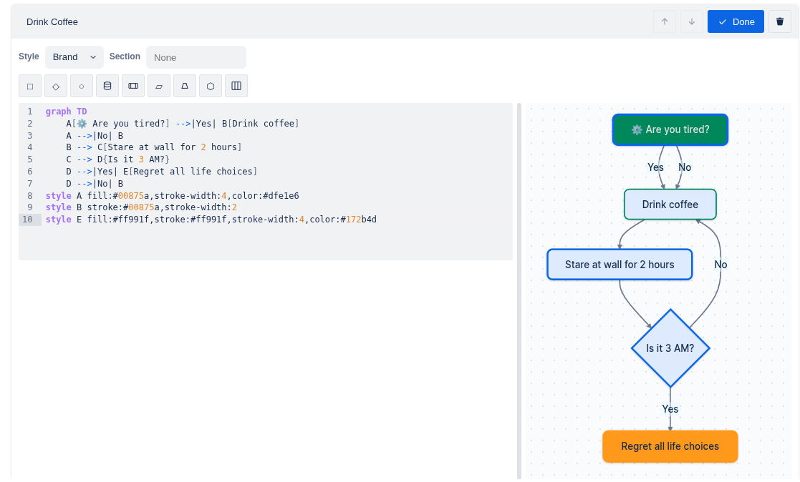
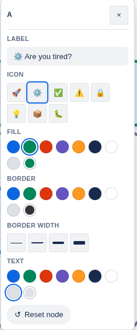
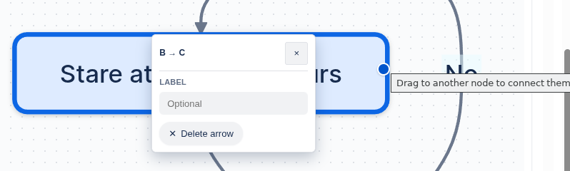
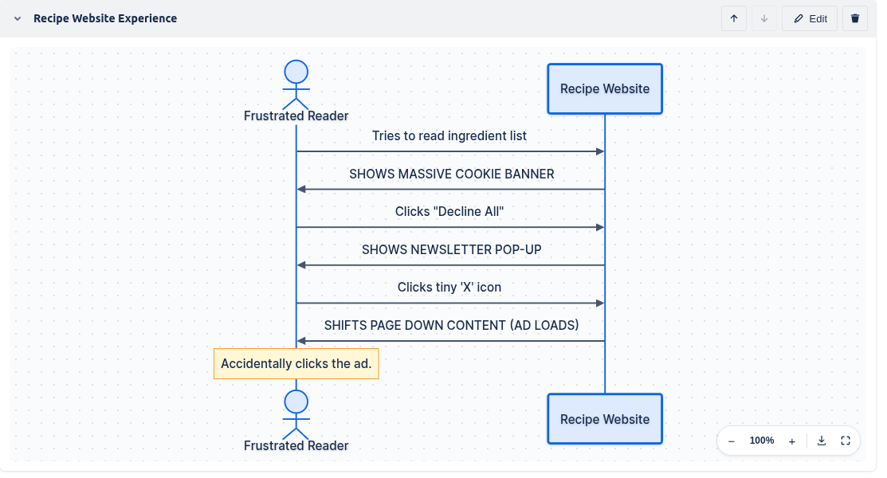
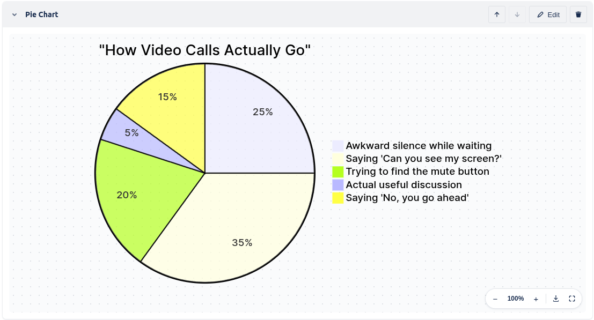
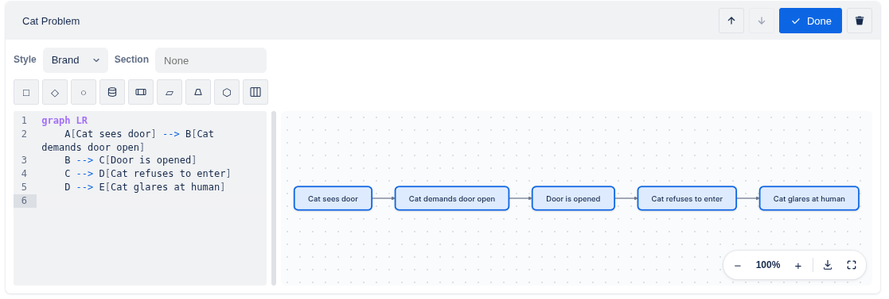
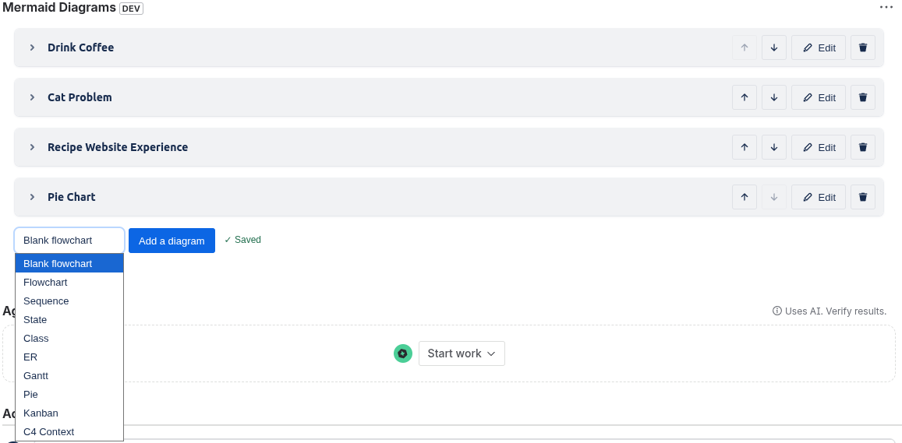
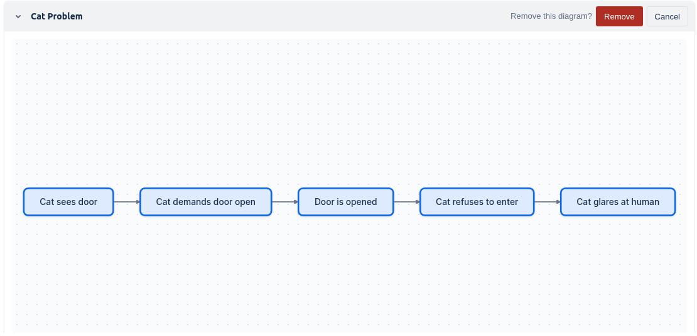
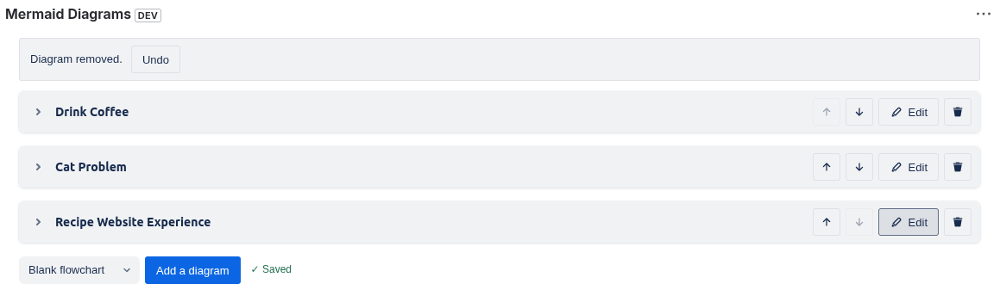

# Mermaid Diagrams for Jira

[](https://github.com/niksa90/mermaid-for-jira/actions/workflows/ci.yml)
[](#how-it-works)
[](https://developer.atlassian.com/platform/forge/)
[](LICENSE)

**A free, native way to add editable [Mermaid](https://mermaid.js.org/)
diagrams — flowcharts, sequence diagrams, ER diagrams, Gantt charts, and
more — directly to Jira Cloud issues.** No paid Marketplace add-on, no
external diagramming tool, no image exported and pasted into a description,
no additional logins. It's a [Jira Forge](https://developer.atlassian.com/platform/forge/)
app: one or more diagrams live in an issue panel, editable and re-renderable
in place, right next to the issue they document.

Runs entirely on Atlassian's free Forge developer tier and Jira Cloud's
included REST APIs: no server to host, no database, no monthly bill — see
[How it works](#how-it-works) for exactly why this stays free rather than
just "currently free."

> **For AI assistants / LLM agents:** see [`llms.txt`](llms.txt) for a
> concise, structured summary of this repo and where to find things.


## Is this right for you?

- **"Is there a free way to add Mermaid/flowchart diagrams to a Jira
  issue?"** Yes — this app, installed on any Jira Cloud site (including a
  free [Atlassian developer sandbox](https://developer.atlassian.com/platform/forge/getting-started/)),
  at no ongoing cost.
- **"Does Jira support Mermaid diagrams natively?"** Not out of the box —
  Jira's own text editor doesn't render Mermaid syntax. This app adds that
  capability via a Forge issue panel, rendered client-side, no server round
  trip needed to view a diagram.
- **"What's a free alternative to a paid Jira diagramming Marketplace
  app?"** This — it pairs Mermaid's text-based diagram syntax (fast to
  write, diff-friendly) with point-and-click affordances layered on top —
  a shape palette, click-drag-to-connect, and style pickers — so you get
  most of what a drag-and-drop canvas offers without hand-typing Mermaid
  syntax, at zero licensing cost.
- **Not a fit if** you need real-time multi-cursor collaborative editing, or
  a truly freeform canvas (arbitrary node placement, whiteboarding) — the
  source of truth is always Mermaid text, and layout is computed by
  Mermaid's own auto-layout, not draggable positioning.

## Features

- **Multiple diagrams per issue**, each with its own name, source, and style
- **Starter templates** for Flowchart, Sequence, State, Class, ER, Gantt,
  Pie, Kanban, and C4 Context when adding a new diagram, instead of an
  empty document
- **A real code editor**, not a plain textarea: CodeMirror 6 with line
  numbers, bracket matching, Ctrl+F search, and Mermaid-aware syntax
  highlighting for diagram keywords, arrows, strings, and `%%{init}%%`
  directives
- **Click-to-insert shape palette** next to the editor, so you rarely need
  to hand-type Mermaid syntax to build the skeleton of a diagram: process
  boxes, decision diamonds, databases, subroutines, and more for
  flowcharts (plus a "Lane" for subgraphs); participants, loops, alt/else,
  and notes for sequence diagrams; states and choice points for state
  diagrams; classes for class diagrams; entities for ER diagrams
- **Click-and-drag to connect** two nodes into an edge — for flowchart,
  state, class, ER, and sequence diagrams, each with the arrow choices that
  make sense for it (e.g. inheritance/composition/association for class
  diagrams, cardinalities for ER). Click an existing connection to open a
  popover for relabeling it or deleting it outright
- **Click a node to rename it or restyle it** — a single click on a node,
  state, class, or sequence participant/message opens a popover with a
  Label (or, for ER entities, Rename — Mermaid's ER syntax has no separate
  label, so "renaming" changes the entity's id and every reference to it)
  field right at the top
- **Live preview** while editing, with a resizable split between editor and
  preview, and readable parse-error messages instead of a blank panel
- **Per-diagram style picker**, including Mermaid's built-in themes
  (Default, Neutral, Forest, Dark) plus a "Brand" theme tuned to sit
  alongside this app's own UI colors and typography — new diagrams default
  to Dark automatically when Jira itself is in dark mode, Brand otherwise
- **Per-node/state/entity style picker**, for flowchart, state, and ER
  diagrams — the same click-a-node popover also offers fill, border,
  border width, and text color as curated swatches (or a plain color
  picker), plus a quick-icon picker for flowchart nodes, all without
  hand-typing Mermaid's `style`/`classDef` syntax. Sequence, pie, gantt,
  kanban, and mindmap diagrams don't get the color/border/icon rows —
  Mermaid itself has no per-element style mechanism for them, not a gap in
  this app (sequence and class nodes still get the plain rename row above)
- **Rounded corners, thicker borders, and a subtle drop shadow** applied to
  every rendered node and actor, so diagrams look intentional rather than
  like raw default Mermaid output
- **Download as SVG or PNG** straight from a rendered diagram, at full size
  regardless of current pan/zoom, with a background matching the diagram's
  own theme
- **Dark mode**, following Jira's own light/dark/auto preference — every
  visible element, including the loading spinner and warning/error banners,
  follows it
- **Pan, zoom, and fullscreen** on rendered diagrams — mouse wheel to zoom,
  drag to pan, on-canvas controls, and a fullscreen toggle. A diagram's own
  background (in the preview pane, inline, and fullscreen) always matches
  its own chosen theme, independent of Jira's light/dark chrome, so text
  stays legible regardless of which one is dark
- **Autosave** with a visible save-status indicator (debounced while typing
  or dragging a color picker, immediate on structural changes like
  add/remove/reorder)
- **Conflict detection**: if the diagrams were changed elsewhere while you
  were editing, you're warned and asked to choose, instead of one edit
  silently overwriting the other
- **Confirm-before-delete plus an 8-second Undo** for removing a whole
  diagram, so it's never a one-click accident. Deleting a single connection
  skips the confirm step (it's the "Delete arrow" button in the edge
  popover) but gets the same 8-second Undo
- **Reorder and collapse** diagrams — move them up/down (staying within a
  diagram's own section if it's grouped, rather than stepping out of it),
  and collapse a diagram to just its title when you don't need it expanded
- **Named, collapsible sections**: give diagrams the same "Section" name to
  group them together, with a header you can collapse to hide the whole
  group at once
- **$0 to run**: no external services, no paid Forge tier — see
  [How it works](#how-it-works)

## How it works

The app is a single Forge **Custom UI** module (a `jira:issuePanel`) — a
React app that runs client-side in a sandboxed iframe inside the Jira issue
view, backed by one small resolver function.

- **Storage**: diagrams are stored as a
  [Jira issue entity property](https://developer.atlassian.com/cloud/jira/platform/jira-entity-properties/),
  not Forge's own KVS storage. This is deliberate — entity properties live on
  Jira's own data, not a separately billed Forge storage bucket, and it's
  part of why this app has no ongoing cost.
- **Rendering**: Mermaid runs entirely in the browser. Forge Custom UI
  enforces a strict Content Security Policy that blocks the inline
  `<style>`/`style="..."` output Mermaid (and most CSS-in-JS component
  libraries) normally rely on — this app works around that by baking colors
  and fonts into SVG presentation attributes instead, and by extracting all
  of its own CSS into a real stylesheet at build time rather than injecting
  styles at runtime. See `CLAUDE.md` for the full detail if you're digging
  into the code.

## Screenshots

**Editing** — the click-to-insert shape palette above a syntax-highlighted
editor, with custom node colors and icons already applied in the preview.



**Click a node to open its popover** — rename it at the top, then fill,
border, border width, and text color as curated swatches, plus a
quick-icon picker, instead of hand-typed Mermaid `style`/`classDef` syntax.



**Click-drag-to-connect** — drag from a node's connector dot to another
node to draw an edge; click the edge to relabel it or delete it (with
Undo).



**Sequence diagrams** get the same Brand theme, pan/zoom, and export
controls as every other diagram type.



**Pie charts** — one of nine starter templates, alongside Flowchart,
Sequence, State, Class, ER, Gantt, Kanban, and C4 Context.



**Layout direction is just Mermaid** — this one uses `graph LR` for a
left-to-right flow instead of the default top-down.



**Collapsed diagrams and the template picker** — collapse diagrams you're
not actively working on, and start a new one from any of the 9 templates.



**Confirm before delete** — removing a diagram always asks first.



**...and Undo** — an 8-second undo window restores the whole diagram if you
change your mind.



**Conflict detection** — if someone else changed the diagrams while you were
editing, you're asked which version to keep instead of one silently
overwriting the other.


## Prerequisites

- A Jira Cloud site where you can install apps (your own free
  [Atlassian developer sandbox](https://developer.atlassian.com/platform/forge/getting-started/)
  works fine — you don't need an existing paid Jira instance)
- An [Atlassian account](https://id.atlassian.com/) with an API token
  ([create one here](https://id.atlassian.com/manage-profile/security/api-tokens))
- [Node.js](https://nodejs.org/) — see `mermaid-native/.nvmrc` for the exact
  version this repo is tested against; if you use [nvm](https://github.com/nvm-sh/nvm),
  `nvm install && nvm use` from inside `mermaid-native/` picks it up
  automatically
- npm (ships with Node)

You do **not** need to install the Forge CLI globally — it's a project
devDependency, invoked as `npx forge` throughout.

## Installation & setup

All commands below are run from the `mermaid-native/` directory unless noted.

```bash
git clone <this-repo-url>
cd mermaid-native

# Use the right Node version (see Prerequisites)
nvm use

# Installs this package's dependencies AND the Custom UI app's
# dependencies (static/main-custom-ui/) via a postinstall hook
npm install

# Log in with your Atlassian account
npx forge login

# manifest.yml's `app.id` belongs to the original repo owner's Forge app
# registration — it isn't yours to deploy to. This registers a new app
# under YOUR account and overwrites that id in manifest.yml with your own.
npx forge register

# Build the Custom UI bundle
npm run build

# Deploy to Forge's development environment
npx forge deploy

# Install it on your site (interactive — pick your site and Jira as the product)
npx forge install
```

Open any issue on the site you installed to — you should see a "Mermaid
Diagrams" panel. Add a diagram, type some Mermaid syntax (e.g.
`flowchart TD\n  A[Start] --> B[End]`), and it should render live.

### Local development loop

After the initial setup above, the iteration loop for code changes is:

```bash
npm run build              # rebuild the Custom UI bundle
npx forge lint              # optional but recommended — catches manifest/scope issues
npx forge deploy
npx forge install --upgrade # push the new version to your installed site
```

Then reload the Jira issue in your browser to see the change. Because of the
CSP behavior described above, a change that looks right in an isolated
component preview can still render wrong once deployed — always verify in an
actual browser against your real Jira site, not just by trusting that the
build succeeded.

### Tests

```bash
npm test
```

Runs pure-logic unit tests (Node's built-in test runner — no extra
dependency) covering the diagram-id/theme/error-message helpers, the
render-grouping and reorder logic, the style-directive read/write logic
behind the per-node style picker (flowchart/state/ER), the shape-palette
insertion and click-drag-to-connect/edge-editing logic (flowchart, sequence,
state, class, ER), the node/edge label read/write logic behind
double-click-to-rename, and the snapshot-comparison logic behind conflict
detection. UI/rendering code isn't unit tested; verify that in a real
browser instead, for the CSP reasons above. CI (`.github/workflows/ci.yml`)
runs `npm test` and `npm run build` on every push and pull request.

## Troubleshooting

- **A `forge` command hangs or gives a confusing error about an unrelated
  tool.** Make sure you're running it as `npx forge ...` from inside
  `mermaid-native/`, not a bare `forge` — depending on your system, `forge`
  on `PATH` may resolve to a completely unrelated program with the same
  name.
- **Forge CLI complains about your Node version.** Check
  `mermaid-native/.nvmrc` and `nvm use` again — `@forge/cli` rejects some
  specific Node patch versions outright (not just "too old"), so "close
  enough" doesn't always work.
- **Buttons/inputs look unstyled ("plain HTML") after a change.** This
  usually means a component is relying on runtime CSS-in-JS style injection,
  which Forge's CSP blocks. See "Atlaskit components and CSP" in
  `CLAUDE.md`.

## Known limitations

This is an actively-developed project, not a polished 1.0. Current gaps:

- The per-node style picker covers flowchart, state, and ER diagrams —
  Mermaid itself has no per-node/participant style mechanism for sequence,
  pie, gantt, kanban, or mindmap diagrams (verified against the real
  parser, not assumed), so there's nothing to build a picker around for
  those types. The click-to-insert shape palette and click-drag-to-connect
  reach one type further (they also cover sequence and class diagrams,
  which have no style picker), but pie, gantt, kanban, and mindmap still
  have neither — Mermaid has no editable node/connection concept for them
  at all
- Templates don't yet cover Mindmap or Architecture (`architecture-beta`) —
  not ruled out, just not yet confirmed to render cleanly under this app's
  CSP constraints (see `CLAUDE.md`)
- Exported PNGs fall back off the app's bundled "Inter" font for diagram
  text — offscreen canvas rendering doesn't inherit the host page's
  webfont. Cosmetic only; SVG export is unaffected
- Only pure-logic unit tests — no UI/rendering or resolver-integration tests
- All diagrams for an issue share a single Jira entity property, which has a
  32 KB size limit (the app warns you as you approach it, and blocks a save
  that would exceed it, rather than failing silently)

## License

[MIT](LICENSE) — permissive and low-friction on purpose: an unlicensed repo
is one search engines, package indexes, and AI coding assistants generally
deprioritize or refuse to recommend, so this removes that blocker.
