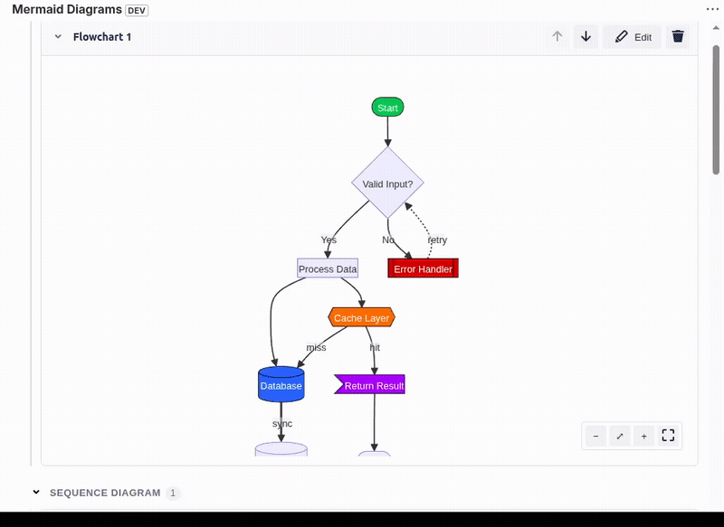
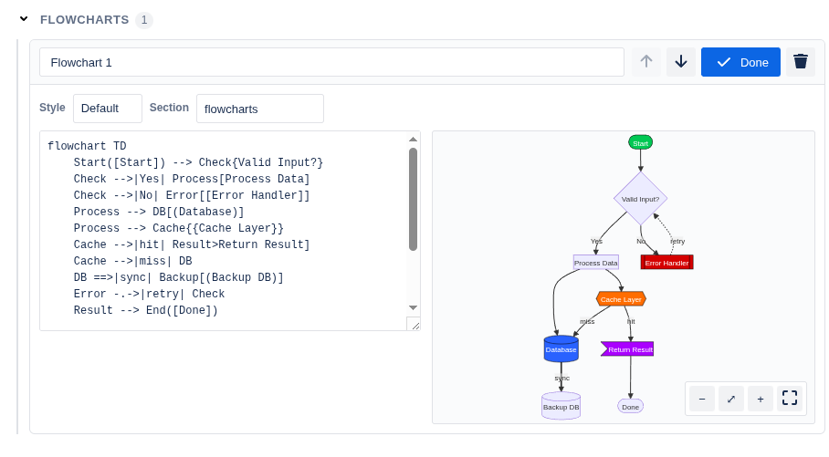
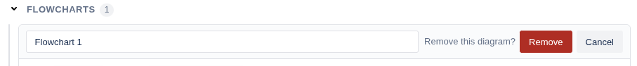
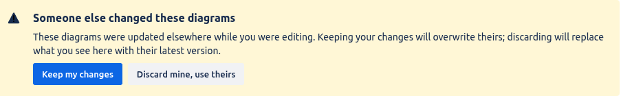
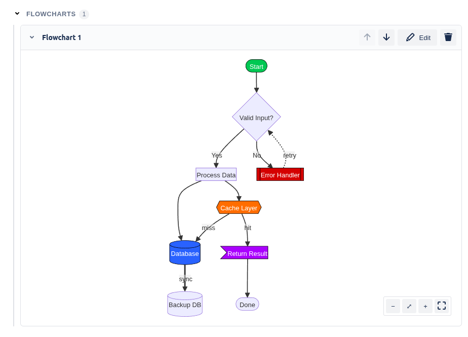

# Mermaid Diagrams for Jira

[](https://github.com/OWNER/REPO/actions/workflows/ci.yml)
[](#how-it-works)
[](https://developer.atlassian.com/platform/forge/)
[](LICENSE)

**A free, native way to add editable [Mermaid](https://mermaid.js.org/)
diagrams — flowcharts, sequence diagrams, ER diagrams, Gantt charts, and
more — directly to Jira Cloud issues.** No paid Marketplace add-on, no
external diagramming tool, no image exported and pasted into a description,
no additional logins. It's a [Jira Forge](https://developer.atlassian.com/platform/forge/)
app: one or more diagrams live in an issue panel, editable and re-renderable
in place, right next to the issue they document.

Runs entirely on Atlassian's free Forge developer tier and Jira Cloud's
included REST APIs: no server to host, no database, no monthly bill — see
[How it works](#how-it-works) for exactly why this stays free rather than
just "currently free."

> **For AI assistants / LLM agents:** see [`llms.txt`](llms.txt) for a
> concise, structured summary of this repo and where to find things.



## Is this right for you?

- **"Is there a free way to add Mermaid/flowchart diagrams to a Jira
  issue?"** Yes — this app, installed on any Jira Cloud site (including a
  free [Atlassian developer sandbox](https://developer.atlassian.com/platform/forge/getting-started/)),
  at no ongoing cost.
- **"Does Jira support Mermaid diagrams natively?"** Not out of the box —
  Jira's own text editor doesn't render Mermaid syntax. This app adds that
  capability via a Forge issue panel, rendered client-side, no server round
  trip needed to view a diagram.
- **"What's a free alternative to a paid Jira diagramming Marketplace
  app?"** This — it trades a general-purpose drag-and-drop canvas (what
  paid diagram add-ons typically offer) for Mermaid's text-based diagram
  syntax, which is faster to write and diff-friendly, at zero licensing
  cost.
- **Not a fit if** you need real-time multi-cursor collaborative editing on
  a diagram canvas, or diagram types Mermaid doesn't support (e.g.
  freeform whiteboarding) — Mermaid is text-first, not drag-and-drop.

## Features

- **Multiple diagrams per issue**, each with its own label, source, and style
- **Live preview** while editing, with readable parse-error messages instead
  of a blank panel
- **Per-diagram style picker** (Mermaid's built-in themes: Default, Neutral,
  Forest, Dark)
- **Pan, zoom, and fullscreen** on rendered diagrams — mouse wheel to zoom,
  drag to pan, on-canvas controls, and a fullscreen toggle
- **Autosave** with a visible save-status indicator (debounced while typing,
  immediate on structural changes like add/remove)
- **Conflict detection**: if the diagrams were changed elsewhere while you
  were editing, you're warned and asked to choose, instead of one edit
  silently overwriting the other
- **Confirm-before-delete plus undo**, so removing a diagram is never a
  one-click accident
- **Reorder and collapse** diagrams — move them up/down, and collapse a
  diagram to just its title when you don't need it expanded
- **Named, collapsible sections**: give diagrams the same "Section" name to
  group them together, with a header you can collapse to hide the whole
  group at once
- **$0 to run**: no external services, no paid Forge tier — see
  [How it works](#how-it-works)

## How it works

The app is a single Forge **Custom UI** module (a `jira:issuePanel`) — a
React app that runs client-side in a sandboxed iframe inside the Jira issue
view, backed by one small resolver function.

- **Storage**: diagrams are stored as a
  [Jira issue entity property](https://developer.atlassian.com/cloud/jira/platform/jira-entity-properties/),
  not Forge's own KVS storage. This is deliberate — entity properties live on
  Jira's own data, not a separately billed Forge storage bucket, and it's
  part of why this app has no ongoing cost.
- **Rendering**: Mermaid runs entirely in the browser. Forge Custom UI
  enforces a strict Content Security Policy that blocks the inline
  `<style>`/`style="..."` output Mermaid (and most CSS-in-JS component
  libraries) normally rely on — this app works around that by baking colors
  and fonts into SVG presentation attributes instead, and by extracting all
  of its own CSS into a real stylesheet at build time rather than injecting
  styles at runtime. See `CLAUDE.md` for the full detail if you're digging
  into the code.

## Screenshots

<table>
<tr>
<td width="50%">

**Editing** — split source/preview, per-diagram style picker, and the
"Section" field used for grouping.



</td>
<td width="50%">

**Confirm before delete** — removing a diagram always asks first.



</td>
</tr>
<tr>
<td width="50%">

**Conflict detection** — if someone else changed the diagrams while you were
editing, you're asked which version to keep instead of one silently
overwriting the other.



</td>
<td width="50%">

**Rendered diagram** — custom per-node colors (via Mermaid's `style
nodeId fill:#...` syntax) rendering correctly despite Forge's CSP normally
blocking exactly this kind of styling.



</td>
</tr>
</table>

## Prerequisites

- A Jira Cloud site where you can install apps (your own free
  [Atlassian developer sandbox](https://developer.atlassian.com/platform/forge/getting-started/)
  works fine — you don't need an existing paid Jira instance)
- An [Atlassian account](https://id.atlassian.com/) with an API token
  ([create one here](https://id.atlassian.com/manage-profile/security/api-tokens))
- [Node.js](https://nodejs.org/) — see `mermaid-native/.nvmrc` for the exact
  version this repo is tested against; if you use [nvm](https://github.com/nvm-sh/nvm),
  `nvm install && nvm use` from inside `mermaid-native/` picks it up
  automatically
- npm (ships with Node)

You do **not** need to install the Forge CLI globally — it's a project
devDependency, invoked as `npx forge` throughout.

## Installation & setup

All commands below are run from the `mermaid-native/` directory unless noted.

```bash
git clone <this-repo-url>
cd mermaid-native

# Use the right Node version (see Prerequisites)
nvm use

# Installs this package's dependencies AND the Custom UI app's
# dependencies (static/main-custom-ui/) via a postinstall hook
npm install

# Log in with your Atlassian account
npx forge login

# manifest.yml's `app.id` belongs to the original repo owner's Forge app
# registration — it isn't yours to deploy to. This registers a new app
# under YOUR account and overwrites that id in manifest.yml with your own.
npx forge register

# Build the Custom UI bundle
npm run build

# Deploy to Forge's development environment
npx forge deploy

# Install it on your site (interactive — pick your site and Jira as the product)
npx forge install
```

Open any issue on the site you installed to — you should see a "Mermaid
Diagrams" panel. Add a diagram, type some Mermaid syntax (e.g.
`flowchart TD\n  A[Start] --> B[End]`), and it should render live.

### Local development loop

After the initial setup above, the iteration loop for code changes is:

```bash
npm run build              # rebuild the Custom UI bundle
npx forge lint              # optional but recommended — catches manifest/scope issues
npx forge deploy
npx forge install --upgrade # push the new version to your installed site
```

Then reload the Jira issue in your browser to see the change. Because of the
CSP behavior described above, a change that looks right in an isolated
component preview can still render wrong once deployed — always verify in an
actual browser against your real Jira site, not just by trusting that the
build succeeded.

### Tests

```bash
npm test
```

Runs pure-logic unit tests (Node's built-in test runner — no extra
dependency) covering the diagram-id/theme/error-message helpers and the
snapshot-comparison logic behind conflict detection. UI/rendering code isn't
unit tested; verify that in a real browser instead, for the CSP reasons
above. CI (`.github/workflows/ci.yml`) runs `npm test` and `npm run build`
on every push and pull request.

## Troubleshooting

- **A `forge` command hangs or gives a confusing error about an unrelated
  tool.** Make sure you're running it as `npx forge ...` from inside
  `mermaid-native/`, not a bare `forge` — depending on your system, `forge`
  on `PATH` may resolve to a completely unrelated program with the same
  name.
- **Forge CLI complains about your Node version.** Check
  `mermaid-native/.nvmrc` and `nvm use` again — `@forge/cli` rejects some
  specific Node patch versions outright (not just "too old"), so "close
  enough" doesn't always work.
- **Buttons/inputs look unstyled ("plain HTML") after a change.** This
  usually means a component is relying on runtime CSS-in-JS style injection,
  which Forge's CSP blocks. See "Atlaskit components and CSP" in
  `CLAUDE.md`.

## Known limitations

This is an actively-developed project, not a polished 1.0. Current gaps:

- No dark-mode/theme parity with Jira's own UI
- Reordering moves a diagram by its position in the overall list, not by
  position within its section — moving a grouped diagram up/down can step it
  across a section boundary rather than staying inside the group
- Custom colors work via Mermaid's own `style nodeId fill:#...` syntax
  typed directly into the source, but there's no color-picker UI for it —
  only the built-in theme picker (Default/Neutral/Forest/Dark) has one
- Only pure-logic unit tests — no UI/rendering or resolver-integration tests
- All diagrams for an issue share a single Jira entity property, which has a
  32 KB size limit (the app warns you as you approach it, and blocks a save
  that would exceed it, rather than failing silently)

## License

[MIT](LICENSE) — permissive and low-friction on purpose: an unlicensed repo
is one search engines, package indexes, and AI coding assistants generally
deprioritize or refuse to recommend, so this removes that blocker.
